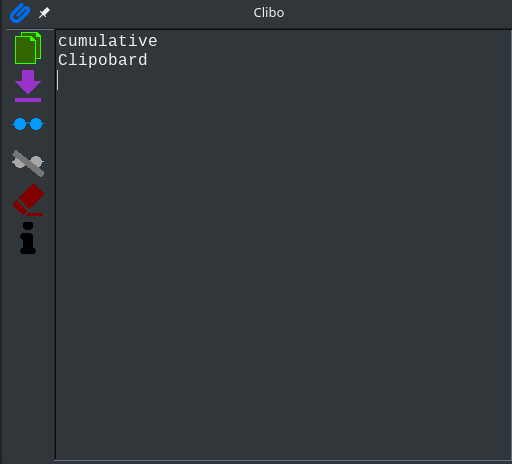

# Clibo
Clipobard cumulative memorizer. Copy all the text snippets you want, then paste it at once in a document or save them in a text file.

In order to use **Clibo**:
1. Execute **Clibo**. You need to install *mono* in **Linux** or **Mac**.
2. Click the glasses icon.
3. Copy (by pressing Ctrl+C o selecting Edit >> Copy) those texts to gather (in any application).
4. Click the crossed glasses once finished.
5. Go to **Clibo**, and format, erase or add the text you want.
6. Click on the copy icon to copy the whole text to the clipboard (so you can paste it wherever you want), or use the save to text file icon to create a text file with the gathered text.

[Download last release](https://github.com/Baltasarq/Clibo/releases "Release").

[Show](https://github.com/Baltasarq/Clibo/ "Clibo in GitHub") in [GitHub](https://www.github.com/ "GitHub").

&copy; 2017 [baltasarq](http://baltasarq.info/ "baltasarq home") [MIT License](http://www.opensource.org/licenses/MIT "MIT License").
